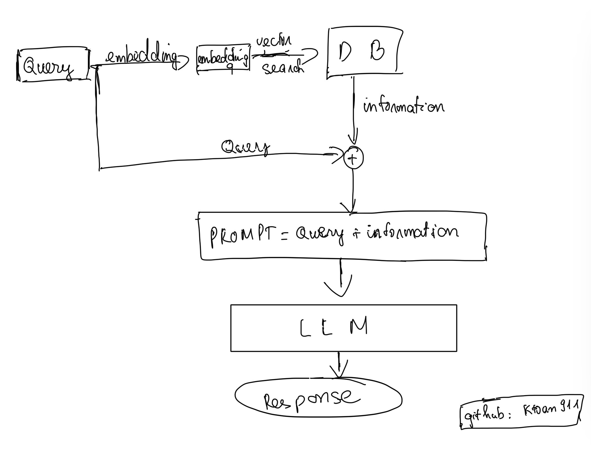
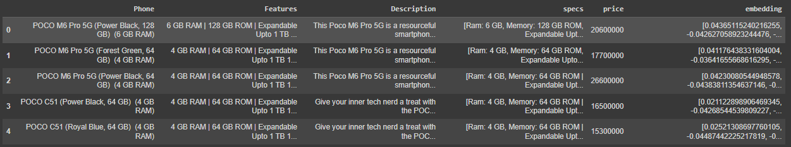
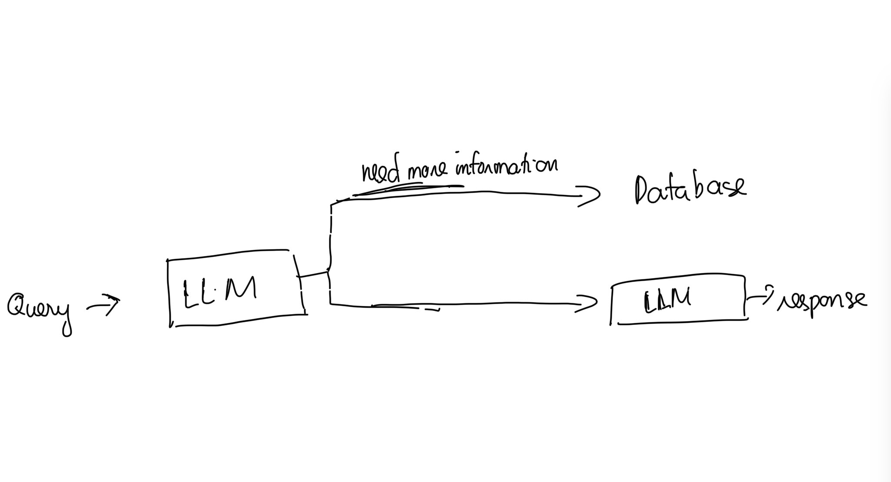

# Phone Sale Assistant Chatbot

- Github: [ktoan911](https://github.com/ktoan911) 
- Email: khanhtoan.forwork@gmail.com 


This chatbot supports phone marketing using the RAG (Retrieval Augmented Generation) architecture. The architecture creates a more powerful model by providing additional information from database retrieval to the model.


## Model Architecture Image



## I. Setting Up the Environment
#### Step 1: Create a Conda environment named your_env_name with Python 3.11.3

```python
conda create -n ${your_env_name} python= 3.11.3
```

#### Step 2: Activate the newly created environment with the following command:
```
conda activate ${your_env_name}
```

#### Step 3: Install the packages from the requirements.txt file

```
pip install -r requirements.txt
``` 

#### Step 4: Create a .env file and add the following lines, replacing the placeholders with your actual values:
```
TOGETHER_API_KEY = 
MONGO_URI = 
EMBEDDING_MODEL = 
WEBSITE = 
DB_NAME = 
COLLECTION_NAME =
```

- TOGETHER_API_KEY: Your key to access the [together.ai API](https://www.together.ai/). 
- MONGO_URI: URI of your MongoDB Atlas instance.
- EMBEDDING_MODEL: Name of the embedding model you're using for text embedding.
- WEBSITE: Link store's website.
- DB_NAME: Name of Database
- COLLECTION_NAME: Name of collection

## II. Data

For this project, we use data following the format below:


- The data set we use includes 320 phone models containing price information and detailed phone descriptions.
- We are using MongoDB Atlas for Vector Search. You can learn how it works and how to do it [here](https://www.mongodb.com/docs/atlas/atlas-vector-search/vector-search-overview/#atlas-vector-search-queries).

## III. Features

- We added the feature to identify questions about whether it is necessary to extract information from the database. This is to save time generating answers and system resources, and at the same time prevent the pattern of rambling answers that are not on point.


- We combine the user's query and the information exported from the database according to the following syntax:

```
"Query: {prompt_query} "Hãy trả lời bằng Tiếng Việt dựa trên thông tin các sản phẩm cửa hàng có như sau (Nếu không có thông tin thì hãy đề xuất sản phẩm khác):" \n {search_result}."
```

- Chatbot has the ability to save context during the conversation to help avoid answering the wrong topic. You can delete the chat history and create a new chat with the chatbot via the button `Làm mới cuộc trò chuyện`.

- After being consulted, customers can also press the button `Đến Website bán hàng` to return to the store's website to continue purchasing.

## IV. Demo and Appplication

This is demo of Phone Sale Assistant Chatbot:

  


